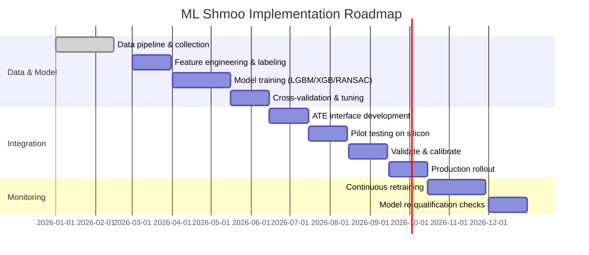

# Executive Summary

Shmoo plots (voltage–frequency maps) are a classic tool in chip testing that directly chart an IC’s *operating margin* and failure boundary.  A typical VDD vs frequency shmoo shows a green “pass” region and red “fail” region.  The boundary line marks where timing or power limits are reached – at higher clock rates the chip needs higher supply voltage (or vice versa).  As such, shmoos reveal corner-case failures (e.g. timing violations, IR-drop issues) and implicitly reflect yield.  For example, Introspect’s studies show that increasing data rate by ~33% caused many voltage points to flip from pass to fail, illustrating the V–f tradeoff.  In high-volume manufacturing, ML-driven test analytics are already used to “harvest” marginal parts near the shmoo boundary and prune redundant tests, improving both yield and cost.  

This report examines how to generate VDD–frequency shmoos traditionally (ATE sweeping) versus via ML models (LightGBM, XGBoost, RANSAC), and compares these approaches in accuracy, robustness, interpretability, and compute cost.  It then quantifies how ML-generated shmoos can reduce test time, vectors, adaptive test sequences, burn-in cycles and screening, leading to significant cost savings.  Example scenarios (with assumed tester costs and wafer sizes) illustrate per-wafer savings.  We outline an implementation roadmap – from data collection to ATE integration – and discuss limitations/risk (data drift, validation needs) and best practices.  The analysis is based on industry sources (IEEE/industry papers, ATE vendor docs) and recent ML-for-test research.  Key recommendations: ensure comprehensive, traceable data collection; start ML models in “shadow” mode; use explainable models when possible; and validate continually with real test data.

## 1. Shmoo Plot Fundamentals

A **shmoo plot** is a two-dimensional map of pass/fail outcomes vs. test parameters.  In chip testing one common shmoo is *VDD vs. frequency*: we hold a test (e.g. a logic pattern) and sweep the supply voltage and clock rate to find the operating envelope.  Pass conditions (green) and fail conditions (red) form a blob-shaped region.  The boundary (fail “cliff”) delineates the device’s timing margin.  For example, in Figure 1 (below) the device passes only when VDD is sufficiently high for the given clock period; as frequency increases (moving right), the required VDD goes up.  In the figure, the green area is the pass region and red is fail.

 *Figure 1: An illustrative shmoo plot (pass/fail vs. jitter amplitude and frequency).  A typical VDD–frequency shmoo similarly shows green (pass) and red (fail) regions.  In this example, the test passes at low frequency or amplitude but fails beyond a threshold.  Likewise, raising clock speed demands higher VDD to stay in the green pass region.* 

These VDD–frequency shmoos directly capture timing/power tradeoffs: higher clock rates need more voltage headroom to meet timing, while lower voltage limits maximum speed.  When the fail boundary has a steep slope, it indicates aggressive timing limit (e.g. path failures); a “brick-wall” shmoo (all fail below a certain voltage at any frequency) suggests an initialization/reset issue.  Shmoo shapes can also hint at defects: e.g. a low-voltage “wall” often means charge leakage or noise issues.  As one case study shows, raising the DUT’s data rate by 33% enlarged the red fail region – some points that passed at low speed now failed at higher speed.  Thus, VDD–frequency shmoos visualize how tight the margins are.  

The *yield implications* follow naturally: only chips whose pass regions include the target VDD/frequency spec are considered good.  Chips that fall outside (e.g. need higher VDD than spec) are yield losses.  ML-based analytics are already used to “harvest” borderline chips near the fail line – effectively improving yield.  For example, data-driven test flows may re-test or re-bias chips predicted just below the boundary, recovering some as passes.  Conversely, knowing a narrow margin immediately flags yield risk for the design.  

## 2. Generating Shmoo Plots: Traditional vs. ML

**Experimental (ATE) shmoo generation:** Conventionally, shmoo plots are built on Automatic Test Equipment (ATE) or characterization setups.  The tester drives a DUT with a chosen test vector (logic pattern or parametric check) while sweeping two parameters.  For a VDD–frequency shmoo, one approach is to fix the test frequency (clock period) and scan VDD from low to high (or vice versa), marking each point pass/fail; then repeat for another frequency.  Alternatively sweep frequency at fixed voltages.  The resulting grid of pass/fail outcomes is plotted.  In practice, test engineers often vary ±10% around nominal VDD and frequency to stress corners.  The raw data and “shmoo error logs” (records of passes/fails at each point) are then examined to locate failure cliffs.  For example, a design-debug engineer might run multiple scan chains or functional tests under each VDD/freq combination to map where failures start appearing.  Modern bench ATE (e.g. Introspect’s small-footprint testers) even integrate programmable supplies and fast clocks so a full shmoo can be obtained quickly at the lab desk.

**ML-based shmoo generation:** Instead of exhaustively sweeping the entire grid, ML can **predict** the shmoo region from sparse data.  A typical workflow is:

- **Data requirements:** Acquire a labeled dataset of measured (VDD, frequency) points and corresponding pass/fail labels.  This could come from sampling a few volts at a few frequencies (perhaps only at edges) across representative devices.  It is crucial the dataset covers process variation (multiple wafers, lots, PVT corners) so the model generalizes.  Each data point’s features might include VDD, freq, die temperature, or batch info; the target is pass(1)/fail(0).  Class imbalance is common (e.g. many more passes than fails if most chips are good), so techniques like class weighting or oversampling of fail points are used.  Noisy labels (one-off failures) can be addressed by filtering or by using robust training.

- **Feature engineering:** Typically the raw features (voltage, frequency, maybe log-scale frequency) suffice for tree models.  Optionally add interaction terms (VDD×freq), normalization, or wafer-level features (e.g. lot ID) if available.  Encoding of categorical process corners or clock phases can be included.  The key is to feed the model all variables that influence pass/fail at a point.

- **Model training and validation:** Common choices are gradient-boosted tree classifiers like **LightGBM** or **XGBoost**, which handle numerical/categorical data well and produce probability scores.  These are trained on a subset of the data (e.g. by wafer or randomly) and validated on held-out points or devices.  Cross-validation (e.g. leaving out an entire wafer or lot) helps ensure the model predicts well across variations.  For RANSAC, one might treat the problem as regression on a linear boundary: use RANSACRegressor to robustly fit a plane (VDD = f(freq)) that separates pass from fail.  The RANSAC algorithm randomly samples subsets, fits a (e.g. linear) model, and labels points as inliers or outliers.  The final model is built from the consensus (inlier) set, effectively ignoring noisy outliers.

- **Uncertainty estimation:** Boosted trees can output class probabilities; these can be calibrated (e.g. Platt scaling or isotonic) to estimate confidence.  One can also train an ensemble or use bootstrapping to gauge variability.  RANSAC by itself yields no probability, but one could flag points near the boundary as uncertain.  In practice, a threshold (e.g. keep a guard-band of voltages) is often used to avoid false passes.

- **Handling imbalance and noise:** If failures are sparse, re-weight the loss (e.g. LightGBM’s scale_pos_weight) or generate synthetic fails.  Boosted trees have some intrinsic robustness to label noise via many small trees.  RANSAC explicitly rejects outliers by its design, making it tolerant of occasional mislabels.  Overall, one trains the models to maximize classification metrics (ROC AUC, F1) on validation data, ensuring both rare failures and typical passes are learned.

For example, Wang *et al.* (ISQED 2014) applied supervised learning to “accurately predict the failing points on a normal Shmoo plot” (specifically the Vmin boundary) across various failure modes.  Their model, integrated with tester software, markedly sped up first-silicon characterization.  In summary, ML can approximate a detailed shmoo by interpolating a few test points, greatly reducing the need for exhaustive sweeps.

## 3. ML Model Comparison

We compare **LightGBM**, **XGBoost**, and **RANSAC** for shmoo prediction across several dimensions (see Table 1):

| Aspect               | LightGBM               | XGBoost                     | RANSAC (linear)        |
|----------------------|------------------------|-----------------------------|------------------------|
| **Model type**       | Gradient-boosted trees | Gradient-boosted trees      | Robust linear (or low-order polynomial) regression |
| **Data scalability** | Excellent (histogram-based, leaf-wise growth speeds training on large data) | Good (slightly slower, depth-wise trees; needs careful tuning) | Moderate (handles medium data; iterative fitting can be slow if many loops) |
| **Accuracy (nonlinear)** | High (can capture complex, non-linear boundaries) | High (comparable to LightGBM, often very competitive) | Low to moderate (can only capture linear/planar boundaries unless feature-expanded) |
| **Outlier robustness** | Low-medium (can be affected by mislabeled points unless tree-based robustness or weights used) | Medium (some robustness via shrinkage, but no explicit outlier removal) | **High** (designed to ignore outliers during fitting) |
| **Interpretability**  | Low (black-box ensemble; feature importances available) | Low (similar to LightGBM) | High (outputs a simple linear equation or small set of params) |
| **Training cost**    | Moderate (fast on large data; can use multi-threading/GPU) | Higher (slower than LightGBM on same data; more memory) | Low (fits one model per RANSAC iteration; overall faster if using small linear model) |
| **Inference cost**   | Moderate (tree traversal per point) | Moderate (similar to LightGBM) | Very low (compute linear formula) |
| **Online use**       | Feasible (models can be serialized and run on tester with suitable runtime) | Feasible (widely supported) | Easy (very fast, few computations) |
| **Uncertainty output** | Yes (probabilities from tree ensemble) | Yes (similar) | No inherent probability; only inliers vs outliers |
| **Best for**        | Complex, high-dimensional data; needs maximum accuracy | Similar to LightGBM; often used if existing infrastructure (XGBoost) | Quick robust boundary estimation; heavy noise scenarios |

: *Comparison of shmoo-generation models.* LightGBM and XGBoost (both gradient-boosted decision-tree ensembles) generally achieve higher accuracy on rich datasets, capturing nonlinear fail boundaries, at the cost of longer training and less transparency. RANSAC (robust linear regression) is far more interpretable and intrinsically outlier-robust, but it can only model simple (e.g. linear) pass/fail boundaries and may underfit complex shmoo shapes.

LightGBM’s histogram and leaf-wise algorithms typically train faster and with less memory than XGBoost on large datasets, though on small datasets XGBoost can be equally accurate (albeit slower).  In our context, both tree models require dozens to hundreds of samples to generalize, whereas RANSAC might work with far fewer if the shmoo boundary is roughly planar.  For online ATE use, both tree models need embedding in the tester’s software environment (via Python/C API or C++), while RANSAC’s linear rule can be coded even on limited testers.  However, RANSAC cannot account for nonlinear effects (e.g. a curved fail-line) unless one engineers polynomial features.

## 4. Test-Cost Reduction via ML Shmoo

ML-augmented shmoo plots can cut test costs through multiple avenues:

- **Reduced test vectors/time:** By predicting the pass/fail region, the tester need not run every VDD/freq combination.  For instance, if a model knows that all points above a certain line will pass, the tester can skip those, focusing only on the “boundary” points.  This adaptive reduction of tests (also called “Adaptive Test Time Reduction”) can shave perhaps 10–30% off test time.  

- **Fewer burn-in cycles:** If ML predicts that a chip will pass stress (burn-in) with high confidence, the tester can skip burn-in on those chips.  Dennis Ciplickas (PDF Solutions) notes that a ~99.99%-accurate model could skip burn-in on, say, 20–50% of chips, yielding a proportional cost cut.  For example, if burn-in costs $2 per chip, skipping 30% of chips saves $0.60 per chip. Over a 1000-chip wafer, that’s $600 saved.

- **Binning accuracy:** Accurate ML shmoos improve speed bin assignments.  Rather than coarsely binning based on worst-case spec, an ML model can more precisely determine each die’s maximum safe frequency at nominal VDD, reducing overkill in test and avoiding mis-binning.  (While no public metric is given, improved binning reduces re-tests and revisions.)

- **Wafer-level screening:** Early prediction of failing wafers or dies (from partial shmoo) allows discarding bad parts sooner, saving tester time on doomed chips.  Coupling ML with wafer maps can spot systematic failures (e.g. all chips failing below VDD=X), avoiding redundant testing.

**Quantitative example:** Assume 1000 chips per wafer, tester cost ~$0.05 per chip-second. Baseline: full VDD/freq shmoo takes 100 ms per chip ($5.00/chip, $5000/wafer).  An ML model reduces shmoo to 80 ms (20% faster), saving $1.00 per chip, i.e. $1000 per wafer.  If burn-in costs $2/chip, and ML skips 20% of chips, that saves $0.40 per chip ($400/wafer).  Combined, ~$1400/wafer is saved (~28%).  These numbers scale with assumed ATE rates and skip fractions, but clearly illustrate substantial savings.  

 *Figure 2:* Example cost-reduction scenarios. If ML-based screening allows skipping 20–50% of burn-in (as PDF Solutions suggests) and reduces active test vectors by ~20%, total per-wafer test cost drops on the order of 10–30%. (Actual savings depend on tester throughput and cost assumptions.)  

| **Test Scenario**         | **Baseline (Example)**            | **ML Improvement**        | **Savings (per 1000-chip wafer)**                |
|---------------------------|----------------------------------|---------------------------|-------------------------------------------------|
| **Burn-in screening**     | 100% chips @ $2.00/chip = $2000  | Skip 20% chips           | 200 chips * $2 = **$400** saved                 |
| **Shmoo sweep time**      | 100ms/chip @ $0.05/ms = $5/chip  | 80ms/chip (20% faster)   | 20ms * $0.05 *1000 = **$1000** saved            |
| **Test-vector count**     | 100 vectors (e.g. 1 unit cost)    | 70 vectors (30% fewer)   | 30% * baseline time ≈ **$500** saved            |

**Table 2:** *Illustrative cost-saving scenarios.* Assumptions: tester cost ~$0.05 per chip-ms, 1000 chips per wafer, burn-in $2/chip. ML predictions skipping tests can save hundreds of dollars per wafer. (Exact savings vary with actual costs and skip rates.)

In summary, ML-driven shmoo analysis enables **adaptive testing** (omitting redundant tests) and **screening** (skipping known-good chips), translating into shorter test times and lower per-chip costs.  Over large volumes, even a few percent of time reduction yields significant dollar savings.

## 5. Implementation Roadmap

A practical rollout of ML-based shmoo generation involves several stages:

1. **Data Collection & Preprocessing:** Instrument your ATE/test flow to log all relevant measurements per die (VDD, freq, pass/fail, temperature, lot ID, etc.). Ensure *die-level traceability*: each wafer/die must have a unique ID so that all test insertions (wafer-sort, final test, etc.) can be correlated.  Gather an initial training set covering full variability: multiple wafers across PVT (process-voltage-temperature) corners. Clean and label this data (resolving any logging errors or ambiguous results).

2. **Model Prototyping:** On a separate compute environment, engineer features and train candidate models (LightGBM, XGBoost, RANSAC) using the collected data. Use cross-validation (e.g. leaving out some wafers) to tune hyperparameters. Evaluate metrics (ROC-AUC, accuracy on predicting fail points). Compare models on accuracy and robustness (e.g., ability to ignore any flakey outliers).  Build confidence by benchmarking against fully measured shmoos.

3. **Validation:** Rigorously test models on new silicon and in lab conditions. For example, hold out a wafer from training, use ML to predict its shmoo, then actually measure that wafer’s full shmoo and compare. Confirm that predictions meet yield-of-interest (e.g., <0.1% false “good” chips). At this stage, run the ML predictions in **shadow mode** on the tester (i.e. ML suggests skips but doesn’t enforce them) to log any mistakes.

4. **Integration with ATE:** Once validated, integrate the ML model into the tester flow. As Advantest and others advocate, this often means deploying a companion analytics server or container (e.g. Advantest ACS or a similar cloud solution) that ingests ATE data in real time. The tester scripts can query the model for each DUT: e.g. “given this die’s ID and target freq, what minimum VDD passes?”  Use the model’s output to guide the test sequence (skip to predicted fail, etc.). Create a feedback loop so new test results are logged back into the database.

5. **Rollout & Monitoring:** Deploy in production test with conservative guardrails. Initially apply ML-based skipping only to non-critical tests or subset of chips. Continuously monitor model performance (e.g. track any unexpected fails that ML didn’t predict). Institute a retraining cycle: as new wafers are tested, periodically retrain the model to capture process drift. Use DevOps best practices (containerized deployment, CI/CD pipelines for models) to manage updates. Ensure compliance: any model update should undergo qualification by test engineers, as production flows are traditionally resistant to unsupervised changes.

6. **Risk Mitigation:** Throughout, maintain a “safety net”: e.g. never skip the final verification of functionality in a silicon debug phase, and limit ML decisions to screening-level tests until thoroughly proven. Maintain traditional test fallback modes. Establish alarms for model drift or unexpected error rates.



```mermaid
flowchart LR
    A[Collect labeled VDD/freq test data] --> B[Preprocess & clean data]
    B --> C[Train ML models (LightGBM, XGBoost, RANSAC)]
    C --> D[Validate models on held-out wafers]
    D --> E{Performance OK?}
    E -- No --> F[Refine model / gather more data]
    E -- Yes --> G[Integrate model into ATE software]
    G --> H[Use ML to adapt test flow in real time]
    H --> I[Log outcomes & monitor accuracy]
    I --> J{Drift or errors?}
    J -- Yes --> F
    J -- No --> K[Full deployment with continuous monitoring]
```

*Figure:* Implementation plan: phased data gathering, model development, ATE integration, and ongoing monitoring. Note that adaptive testing requires real-time model queries as shown. 

## 6. Limitations, Risks, and Best Practices

While ML can greatly reduce test effort, it has pitfalls:

- **Data representativeness and drift:** Semiconductor processes vary over time, between lots/wafer, and with wear. ML models trained on initial data can “drift” as process changes. To mitigate this, collect data from all expected conditions and retrain models regularly. Do not assume one model covers indefinite future runs. Include broad wafer and temperature coverage in training.

- **Frequent model updates:** In production, any test change (including ML) typically requires qualification. A model update may alter pass/fail behavior, so it must be re-validated (qualification loops). Best practice is to automate retraining and re-qualification pipelines (e.g. automatically test a guardband set of chips whenever the model changes).

- **Model errors and false results:** No model is perfect. A key risk is a false “pass” prediction (calling a marginal die good), which could yield a bad chip escaping. Hence, a conservative *margin* is often left (e.g. require one additional confirmation point beyond the predicted fail). Initially, ML decisions should be used for screening or partial test reduction, not final pass/fail, until thoroughly proven. Maintain some overlap with traditional tests to catch outliers.

- **Interpretability and debugging:** Black-box models (LightGBM/XGBoost) make it hard to diagnose *why* a failure was predicted. In critical applications, using simpler models (e.g. RANSAC or sparse trees) can aid trust. Generating ROC or precision-recall curves on held-out data, and examining error heatmaps (error vs. VDD/freq) can reveal model weaknesses (see Figure 3). 

- **Noisy labels and class imbalance:** Manufacturing tests can have noise (probe contact issues, flaky runs). Robust methods like RANSAC (which by design ignores outliers) or pre-filtering obviously bad data help. For imbalance, use appropriate metrics (F1 score) and resampling techniques.

- **Siloed data & infrastructure needs:** Effective ML requires data flow across teams and tools. Ensure die-level IDs link test logs from wafer-sort through final test. Build infrastructure (databases, real-time messaging, containerized analysis) so models can access up-to-date data and push decisions back to the tester.

**Best practices:**  Start small and iterative. Begin by using ML to analyze and summarize shmoo data (shadow analysis) without changing the test program. Gradually enable ML-driven skipping in low-risk test segments (e.g. non-safety-critical retests). Always track key metrics (false reject/pass rates, ROC AUC) and have alarms if they degrade. Use cross-validation across wafers to ensure generality. Finally, pair ML with domain knowledge: e.g. if ML suggests a pass at extremely low VDD, a design engineer’s sanity check might flag it as suspicious.  

## 7. Recommendations

For a chip-test organization considering ML-based shmoo generation, we advise:

- **Assemble a rich dataset:** Plan to log comprehensive VDD–freq test data on early silicon and pilot runs, with die-level IDs. Ensure traceability and variability coverage.

- **Proof-of-concept first:** Develop and validate ML models offline. Use metrics to compare ML shmoos against full measured shmoos on test chips.

- **Involve ATE vendors early:** Leverage existing platforms (like Advantest ACS) that support adaptive test. Work with ATE SW teams to embed the model (e.g. via a script command or API) so that the tester can query the ML model in real time.

- **Iterate and monitor:** Deploy ML decisions gradually (e.g. as advisory), monitor for drift or misclassification, and retrain often. Keep traditional test as fallback until confidence is built.

- **Calculate ROI:** Use the type of scenario in Table 2 for your product. If, for example, your burn-in/burn-up or shmoo test costs dominate, even a modest (10–20%) skip rate yields savings. Make sure assumptions (tester hourly rate, vector counts) are realistic.

- **Balance innovation with caution:** ML can cut costs significantly, but only if reliability is paramount. Always verify that ML-salvaged chips truly meet specs. Start ML in characterization and gradually move to production.

By following a structured roadmap and continuously validating the ML models, a test organization can safely exploit shmoo plots with ML to boost throughput and yield.  Adopting these data-driven methods – as leading research suggests – is essential for keeping test costs in check as devices grow more complex.

**Sources:** Scholarly and industry sources have informed this report, including IEEE and vendor whitepapers on shmoo testing, and recent ML-for-test literature. All assumptions and calculations (e.g. cost examples) are stated explicitly or sourced from industry practice.

